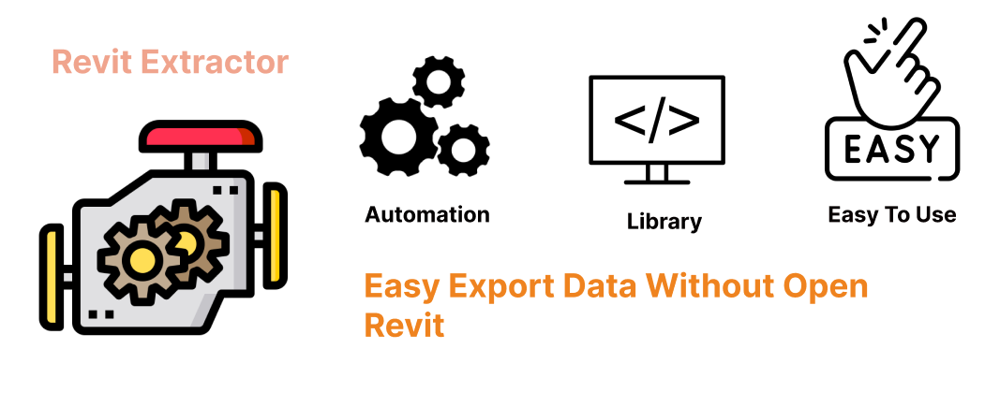

## Revit Extractor

This is a library allow export native data from Revit file without Open Revit, it's useful for extract data from Revit file to another system.




## Requirement

- Make sure you have Revit installed on your machine.
- Make sure you have Python installed on your machine version `3.9` or later.

## How to use

1. Install the library by using pip:
```bash
pip install revit-extractor --upgrade
```

2. Use the library in your code:

- Extract all categories from Revit file:

```python
from revit_extract import RevitExtractor
rvt_path = r"D:\_WIP\Download\Sample Office Building Model V1.rvt"
prodb = RevitExtractor(rvt_path).read_prob_data()
categories = prodb.get_all_categories()
for key in categories:
    print(key, categories[key])
```

- Extract data by category and parameter
```python
from revit_extract import RevitExtractor
rvt_path = r"D:\_WIP\Download\Sample Office Building Model V1.rvt"
prodb = RevitExtractor(rvt_path).read_prob_data()
categories =["Walls", "Doors"]
params = ["Name", "Type", "Level"]
data_frame = prodb.get_data_by_categories_and_params(categories, params)
data_frame.to_excel("output.xlsx", index=False)
```